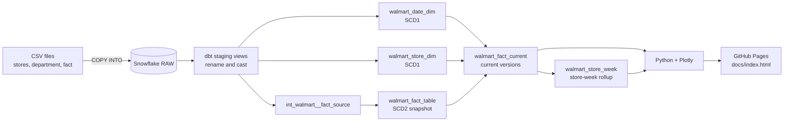

# Walmart Sales Analytics

An end-to-end analytics pipeline for weekly sales across 45 Walmart stores, February 2010 to October 2012. Raw CSVs load into Snowflake, dbt builds a star schema with two SCD Type 1 dimensions and an SCD Type 2 fact table, and Python renders ten interactive Plotly reports, published as a static page on GitHub Pages. Built for the Data Engineer Academy BI mini project.

**Live reports:** https://ryankirsch88.github.io/walmart_sales_analytics/

**Stack:** Snowflake · dbt (v2) · Python · Plotly · GitHub Pages

## Contents

1. [Architecture](#architecture)
2. [Data model](#data-model)
3. [How SCD1 and SCD2 work](#how-scd1-and-scd2-work)
4. [SCD proof](#scd-proof)
5. [Data quality](#data-quality)
6. [Reports](#reports)
7. [Reproduce it](#reproduce-it)
8. [Decisions and trade-offs](#decisions-and-trade-offs)
9. [Repository layout](#repository-layout)

## Architecture



Only the fact table keeps history. The dimensions update in place, and every report reads current fact versions through the two reporting views.

## Data model

| Table | Grain | Key | SCD | Rows |
| --- | --- | --- | --- | --- |
| `walmart_date_dim` | One row per week | `date_id` (YYYYMMDD integer) | Type 1 | 182 |
| `walmart_store_dim` | One row per store-department pair with sales | `store_id`, `dept_id` | Type 1 | 3,331 |
| `walmart_fact_table` | One row per store, department and week, per version | `store_id`, `dept_id`, `date_id`, `vrsn_start_date` | Type 2 | 421,570 current |

**Columns**

- `walmart_date_dim`: `date_id`, `store_date`, `isholiday` (Y/N), `insert_date`, `update_date`
- `walmart_store_dim`: `store_id`, `dept_id`, `store_type` (A/B/C), `store_size`, `insert_date`, `update_date`
- `walmart_fact_table`: `store_id`, `dept_id`, `date_id`, `store_size`, `store_weekly_sales`, `fuel_price`, `store_temperature`, `unemployment`, `cpi`, `markdown1` to `markdown5`, `insert_date`, `update_date`, `vrsn_start_date`, `vrsn_end_date`

**Reporting views**

| View | Grain | Purpose |
| --- | --- | --- |
| `walmart_fact_current` | Store, department, week | Current fact versions joined to both dimensions, plus year, month and week columns |
| `walmart_store_week` | Store, week | Sales summed across departments; store-week measures (temperature, fuel, CPI, unemployment, markdowns) taken once |

The fact table repeats each store-week measure on every department row, about 65 times per store-week (421,570 rows / 6,435 store-weeks). Summing those measures over the fact inflates them, so reports that use them read `walmart_store_week`.

## How SCD1 and SCD2 work

### SCD1: incremental merge with a changed-row filter

Both dimensions are incremental models that merge on their natural key. `insert_date` is excluded from the merge, so it keeps its original value when a row is updated.

```sql
{{ config(
    materialized = 'incremental',
    incremental_strategy = 'merge',
    unique_key = ['store_id', 'dept_id'],
    merge_exclude_columns = ['insert_date'],
    on_schema_change = 'fail'
) }}
```

On incremental runs, a filter keeps only new or changed rows, so unchanged rows never reach the merge and their `update_date` stays put:

```sql

where not exists (
    select 1 from {{ this }} t
    where t.store_id = f.store_id
      and t.dept_id  = f.dept_id
      and equal_null(t.store_type, f.store_type)
      and equal_null(t.store_size, f.store_size)
)

```

| Source change | Result |
| --- | --- |
| New key | Inserted; `insert_date` and `update_date` set to the run time |
| Tracked attribute changed | Updated in place; `update_date` moves, `insert_date` doesn't |
| No change | Filtered out; row untouched |

### SCD2: dbt snapshot

The fact table is a dbt snapshot over `int_walmart__fact_source`, using the `check` strategy and renamed metadata columns:

```yaml
snapshots:
  - name: walmart_fact_table
    relation: ref('int_walmart__fact_source')
    config:
      unique_key: [store_id, dept_id, date_id]
      strategy: check
      check_cols: [store_weekly_sales, store_size, fuel_price, store_temperature,
                   unemployment, cpi, markdown1, markdown2, markdown3, markdown4, markdown5]
      dbt_valid_to_current: "to_timestamp_ntz('9999-12-31')"
      snapshot_meta_column_names:
        dbt_valid_from: vrsn_start_date
        dbt_valid_to: vrsn_end_date
      post_hook:
        - "update {{ this }} set update_date = vrsn_end_date where vrsn_end_date < '9999-12-31' and update_date < vrsn_end_date"
```

- When any `check_cols` value changes for a key, dbt end-dates the current row at the run time and inserts a new current row ending 9999-12-31.
- `check_cols` lists the measures explicitly. The audit timestamps change on every run, so including them (or using `check_cols: all`) would version every row on every build.
- `insert_date` records when a version was inserted. The post-hook sets `update_date` to the end date when a version is closed, so it shows the last time the row was written.
- `store_size` is in `check_cols`, so an SCD1 change to a store's size also creates new fact versions for every row of that store.

## SCD proof

Two edits to the RAW tables, each followed by `dbt build`. The edits are in [`snowflake/03_scd_demo.sql`](snowflake/03_scd_demo.sql) and the checks in [`snowflake/04_scd_checks.sql`](snowflake/04_scd_checks.sql).

| Step | RAW change | Fact rows (total / current) | Key store 1, dept 1, 2012-10-26 | Store 1 in store dim |
| --- | --- | --- | --- | --- |
| 1. Baseline | None | 421,570 / 421,570 | 1 version: $27,390.81 | 77 rows, size 151,315 |
| 2. SCD2 change | `weekly_sales` + $100 for the key | 421,571 / 421,570 | 2 versions: $27,390.81 closed, $27,490.81 current | Unchanged |
| 3. SCD1 change | Store 1 `size` + 1,000 | 431,815 / 421,570 | 3 versions: newest carries size 152,315 | 77 rows, size 152,315; `update_date` moved, `insert_date` unchanged |
| 4. Idle rerun | None | 431,815 / 421,570 | Unchanged | Unchanged |

What each step proves:

- **Step 2:** the snapshot closes the old version and inserts a new one, and no other key changes.
- **Step 3:** the store dimension updates in place, with no new rows. The fact gains one version for each of store 1's 10,244 rows, because `store_size` is a tracked fact column.
- **Step 4:** an unchanged source creates no versions and moves no `update_date` values.

After capturing the evidence, both edits were reversed and the models rebuilt, so the published reports use the original data.

## Data quality

### Tests

`dbt build` runs every test after the model it covers. All pass.

| Layer | Tests |
| --- | --- |
| Staging | Unique, not-null keys on all three models; `store_type` in A/B/C; store IDs exist in the stores model; singular test that each week has one holiday flag across both source files |
| Intermediate | Unique `store_id`, `dept_id`, `date_id`; row count equals department sales; `fuel_price` and `store_size` not null, proving both joins matched |
| Dimensions | Unique keys; accepted values for `isholiday` and `store_type`; `update_date >= insert_date` |
| Fact snapshot | `vrsn_end_date > vrsn_start_date`; `date_id` exists in the date dimension; singular tests for exactly one current version per key and for every store-department pair existing in the store dimension |
| Reporting views | Unique grain; `walmart_fact_current` row count equals department sales |

### Profiling findings

Queries in [`snowflake/02_profile.sql`](snowflake/02_profile.sql).

| Check | Finding | Handling |
| --- | --- | --- |
| Row counts | 45 stores, 421,570 department-week sales rows, 8,190 store-week feature rows | Matches the source files |
| Sales dates | 2010-02-05 to 2012-10-26, 143 weeks | Defines the fact's date range |
| Feature dates | 2010-02-05 to 2013-07-26, 182 weeks; 1,755 rows fall after the last sales week | Kept in the date dimension; they join to no fact rows |
| Sales rows without features | 0 | Enforced by the `fuel_price` not-null test |
| Holiday flag | Consistent for every week in both files | The date dimension's grain is the week |
| Negative sales | 1,285 rows (0.3%), totaling -$88,161.56 | Kept as returns, so totals are net |
| Store-department pairs | 3,331 across 81 departments | Store dimension row count |
| Markdowns | NULL before 2011-11-11 | Left NULL, not 0; report 5 labels 2010 "Not recorded" |
| CPI and unemployment | NULL for 585 store-weeks from 2013-05-03 | Outside the sales range; no effect on the fact |

## Reports

Ten charts, one per required report, built by [`reports/build_reports.py`](reports/build_reports.py) from one SQL file each in [`reports/queries/`](reports/queries/).

1. Weekly sales by store and holiday
2. Weekly sales by temperature and year
3. Weekly sales by store size
4. Weekly sales by store type and month
5. Markdown sales by year and store
6. Weekly sales by store type
7. Fuel price by year
8. Weekly sales by year, month and date
9. Weekly sales by CPI
10. Department-wise weekly sales

Each chart follows the main visual of its reference report in the requirements, with three deliberate differences:

| Report | Reference | This build | Why |
| --- | --- | --- | --- |
| 2. Temperature and year | Waterfall over individual temperatures | Grouped bars by 10°F band, one bar per year | A waterfall implies running totals, which temperature doesn't have |
| 5. Markdowns | Totals near $1B for 2012 | Totals near $14M for 2012 | The reference summed markdowns at department grain, counting each store-week about 65 times |
| 7. Fuel price | Donut of summed fuel prices | Average price per year | A sum of prices has no meaning |

## Reproduce it

**Prerequisites:** a Snowflake account, a dbt platform account (the free Developer plan works) or dbt Core with `dbt-snowflake`, Python 3.10 or later, and OpenSSL.

1. **Create a key pair** for the service user. Keep both files out of the repo.

   ```bash
   mkdir -p ~/.snowflake && cd ~/.snowflake
   openssl genrsa 2048 | openssl pkcs8 -topk8 -v2 aes-256-cbc -inform PEM -out walmart_svc_key.p8
   openssl rsa -in walmart_svc_key.p8 -pubout -out walmart_svc_key.pub
   ```

2. **Set up Snowflake.** Paste the public key (without its BEGIN and END lines) into [`snowflake/00_setup.sql`](snowflake/00_setup.sql) and run it in Snowsight. It creates `WALMART_WH`, `WALMART_DB.RAW`, the `WALMART_TRANSFORMER` role and the `WALMART_SVC` service user.
3. **Load the raw data.** Run [`snowflake/01_raw.sql`](snowflake/01_raw.sql), upload the three CSVs to `@walmart_db.raw.landing` in Snowsight, then run its `COPY INTO` statements. Check the load with [`snowflake/02_profile.sql`](snowflake/02_profile.sql).
4. **Connect dbt.** Snowflake connection: database `WALMART_DB`, warehouse `WALMART_WH`, role `WALMART_TRANSFORMER`. Development credentials: key pair auth as `WALMART_SVC`. Set the project subdirectory to `dbt`.
5. **Build the models.**

   ```bash
   dbt deps
   dbt build
   ```

   This builds the staging views, both dimensions, the fact snapshot and the reporting views, and runs every test. In development, models land in `<your schema>_STAGING` and `<your schema>_MARTS`.

6. **Optional: rerun the SCD proof.** Run the statements in [`snowflake/03_scd_demo.sql`](snowflake/03_scd_demo.sql) one at a time, with `dbt build` and [`snowflake/04_scd_checks.sql`](snowflake/04_scd_checks.sql) after each.
7. **Build the reports.**

   ```bash
   python3 -m venv .venv && source .venv/bin/activate
   pip install -r reports/requirements.txt
   cp reports/.env.example reports/.env   # then fill in your account, key path and marts schema
   python reports/build_reports.py
   open docs/index.html
   ```

8. **Publish.** Commit `docs/index.html`, then in the repo's Settings, Pages, deploy from the `main` branch, `/docs` folder.

## Decisions and trade-offs

| Decision | Why | In production |
| --- | --- | --- |
| Store and department in one dimension | The requirements define `walmart_store_dim` with both `store_id` and `dept_id` | Separate store and department dimensions, so store attributes aren't repeated per department |
| SCD2 with a dbt snapshot instead of a hand-written `MERGE` | dbt handles end-dating and inserting new versions, so there's less custom SQL to get wrong | Same approach; the `timestamp` strategy if the source had a reliable `updated_at` |
| SCD1 with an incremental merge and a changed-row filter | `update_date` moves only when data actually changes | Same, plus a soft-delete flag; this upsert keeps rows that disappear from the source |
| `date_id` as a YYYYMMDD integer | Derived from the date, so the fact needs no lookup join and keys never shift | Same |
| Reporting views at store-week grain | Store-week measures repeat on every department row of the fact | Same, or a dedicated store-week fact table |
| Static HTML on GitHub Pages | Free, needs no running server, and outlives a Snowflake trial | A BI tool or app on live data, refreshed by a scheduled job |
| One key-pair service user for dbt development and Python | Single developer; Snowflake is retiring password-only sign-in for service users | Separate users per tool, and separate dev and prod roles and schemas |
| Manual CSV upload to an internal stage | Three static files | An external stage with Snowpipe or an orchestrated load |

## Repository layout

```text
walmart_sales_analytics/
├── README.md
├── .gitignore              # .env, *.p8, .venv/, target/, dbt_packages/, logs/
├── data/README.md          # where the CSVs come from and how to load them
├── snowflake/
│   ├── 00_setup.sql        # warehouse, database, role, service user
│   ├── 01_raw.sql          # file format, stage, RAW tables, COPY INTO
│   ├── 02_profile.sql      # profiling queries
│   ├── 03_scd_demo.sql     # RAW edits for the SCD proof
│   └── 04_scd_checks.sql   # evidence queries for the SCD proof
├── dbt/
│   ├── dbt_project.yml
│   ├── packages.yml        # dbt_utils
│   ├── macros/to_date_id.sql
│   ├── models/
│   │   ├── staging/        # sources + 3 staging views
│   │   ├── intermediate/   # int_walmart__fact_source
│   │   └── marts/          # 2 SCD1 dims + 2 reporting views
│   ├── snapshots/          # walmart_fact_table (SCD2)
│   └── tests/              # singular tests
├── reports/
│   ├── requirements.txt
│   ├── .env.example
│   ├── db.py               # Snowflake connection
│   ├── queries/            # one SQL file per report
│   └── build_reports.py    # queries to charts to docs/index.html
└── docs/
    └── index.html          # published reports
```